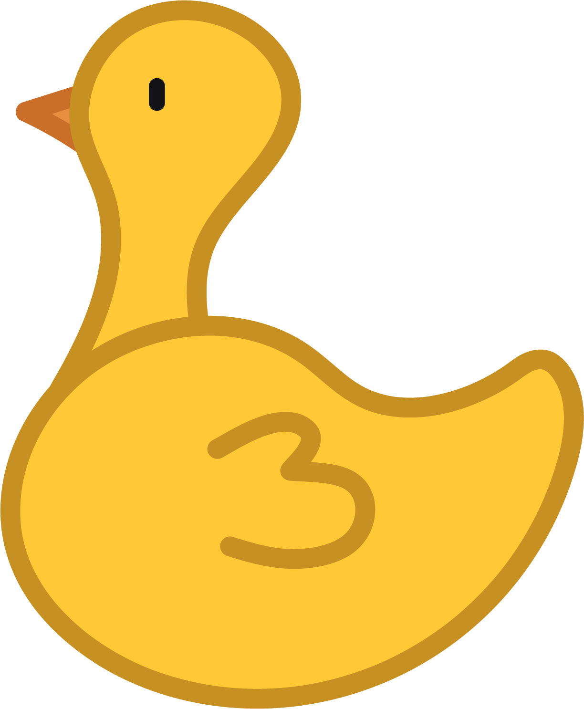

# ducc. Robotics: World Robot Olympiad 2023

This repository contains the working files and source code for ducc's ***world record* full score run** for the 2023 World Robot Olympiad (WRO) RoboMission Senior competition.

Watch the *world record* run [here](https://www.youtube.com/watch?v=GQTzt-nbOSA). A full 3D CAD model of our competition robot can be found in the [robot](robot) folder.

## About

ducc. is a three-man team comprising Neo Hao Jun, Isaac Tan, and Ng Aaron from the Hwa Chong Robotics Club in Singapore.

## Accolades

We managed to clinch the following awards at the World Robot Olympiad Singapore Nationals:

- Overall 3rd Runner Up
- Judges' Award (Innovation)
- Side Quest 3 1st Runner Up
- Side Quest 4 Champion
- Side Quest 5 Champion

While the results we achieved were less than ideal, we would like to thank Team Clutch from Singapore Polytechnic, who will be representing Team Singapore in Panama, for being such great competitors: we learnt a lot, and it was a blast competing with you guys.

## Acknowledgements

We would like to thank the Hwa Chong Robotics Club for providing us the necessary resources and funding to experiment and develop our robot for this competition.

We would also like to thank OFDL Robotics Lab Taiwan for the extensive work they have invested into developing a suite of useful EV3 blocks that extends the capabilities of the LEGO® MINDSTORMS® EV3 platform greatly, impacting not just us, but also numerous other teams around the globe.

## Technologies

This project was initially built with Pybricks, an API built on MicroPython. As Pybricks was still pre-release, we gradually shifted to the LEGO® MINDSTORMS® EV3-G platform instead.

## Intellectual Property

### Copyright

© 2023, ducc. Robotics Competition Team.

While we have made every effort to abide by legal and ethical requirements when using works we did not create, some may have been overlooked inadvertently. Please let us know and we will be happy to make the necessary arrangements.